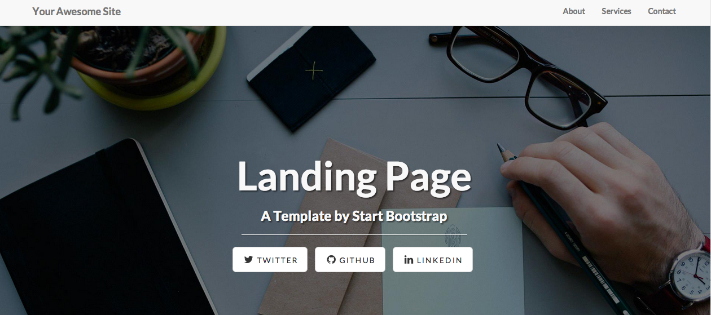

# WordpressThemeDemo

This repo is a theme custom-built. Design is provided by <a href='http://shaneweng.com/'>Shane Weng</a>

To make this theme worked, follow these steps:
1. Create new directory in theme folder (wp-content/themes)
2. Pull source from this github repo
3. Refresh theme management page, you can see this theme in setting page
4. Make sure to create a page (not a post) in Wordpress and name the slug link as "about-us"
5. Refresh the home page to see new design

To test custom post type, follow these steps:
1. Create new table name "product" inside Wordpress database (Fields are up to you). Current db name is: 'bitnami_wordpress'
2. Populate data for this new table
3. Visit this page: <Wordpress local url>/movies/test/?query_func=mydb to see the result. The parameter for this page is 'query_func' might be:
  - '' : Blank to get list of posts
  - 'mydb': To execute custom db query getting list of product
